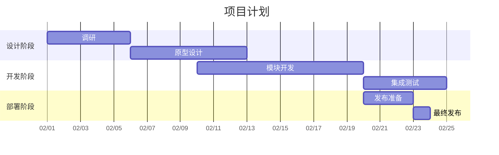

## 一、标题
# 标题一   
{: .mt-4  .mb-0 }
## 标题二   
{: data-toc-skip='' }
### 标题三  
{: data-toc-skip=''}
#### 标题四  
{: data-toc-skip=''}

## 二、段落

<p style="text-indent: 2em;">这是一段段落文字，这是一段段落文字，这是一段段落文字，这是一段段落文字，这是一段段落文字，这是一段段落文字，这是一段段落文字，这是一段段落文字，这是一段段落文字，这是一段段落文字，这是一段段落文字，这是一段段落文字，这是一段段落文字，这是一段段落文字，这是一段段落文字，这是一段段落文字，这是一段段落文字，这是一段段落文字，这是一段段落文字，这是一段段落文字，这是一段段落文字</p>

这是一段段落文字，这是一段段落文字，这是一段段落文字，这是一段段落文字，这是一段段落文字，这是一段段落文字，这是一段段落文字，这是一段段落文字，这是一段段落文字，这是一段段落文字，这是一段段落文字，这是一段段落文字，这是一段段落文字，这是一段段落文字，这是一段段落文字，这是一段段落文字，这是一段段落文字，这是一段段落文字，这是一段段落文字，这是一段段落文字，这是一段段落文字

这是一段段落文字，这是一段段落文字，这是一段段落文字，这是一段段落文字，这是一段段落文字，这是一段段落文字，这是一段段落文字，这是一段段落文字，这是一段段落文字，这是一段段落文字，这是一段段落文字，这是一段段落文字，这是一段段落文字，这是一段段落文字，这是一段段落文字，这是一段段落文字，这是一段段落文字，这是一段段落文字，这是一段段落文字，这是一段段落文字，这是一段段落文字

## 三、文字样式
*斜体*  
**加粗**  
***粗斜体***  
<u>html下划线</u>  
~~删除线~~  
<span style = "background-color: red; color: yellow;">html背景色及文字颜色</span>  
<span style = "font-family: Microsoft YaHei; font-size: 30px;">html字体(微软雅黑)及字号(30)</span>  

## 四、列表
### 有序列表  
1. 首先  
    1. 第一小点
    2. 第二小点
2. 其次  
3. 最后  

### 无序列表  
- **第一点**   
    - 小点  
    - 小点  
- **第二点**  

### 任务列表
- [ ] 今日计划
  - [x] 学习
  - [x] 运动
  - [ ] 观影

### 描述列表

html(超文本标记语言)  
: 语法复杂，需要使用开放和闭合标签  

markdown(轻量级标记语言)  
: 语法简洁，用自然语言风格的符号表示  

## 五、块引用
> 这是一个块引用  
> 
> 引用结束

## 六、提示
> 一个`提示`类型的提示
{: .prompt-tip }

> 一个`信息`类型的提示
{: .prompt-info }

> 一个`警告`类型的提示
{: .prompt-warning }

> 一个`危险`类型的提示
{: .prompt-danger }

## 七、表格
“:”在前面左对齐，在后面右对齐，前后都有则居中

|序列化方式|性能|可读性|
|:---|:---|:---|
|二进制|好|差|
|Json|中等|中等|
|Xml|差|好|

## 八、链接
链接  
<https://markdown.com.cn>  

链接(自定义显示文字)  
[本站地址](https://luocangli.github.io)  

## 九、脚注
本博客模板以及本文参考皆来自Cotes Chung[^CotesChung]大佬

## 十、行内代码
这是一个`行内代码`的例子

## 十一、文件路径
这是一个文件路径 `/path/to/the/file.extend`{: .filepath}的例子

## 十二、代码块
```csharp
using System;

namespace MyNamespace
{
    public Class Program
    {
        /// <summary>
        /// 构造方法
        /// </summary>
        public Program()
        {

        }

        /// <summary>
        /// 应用程序的入口
        /// </summary>
        /// <param name="args">命令行参数</param>
        public static void Main(string[] args)
        {
            Console.Writeline("Hello World!");
        }
    }
}
```

## 十三、数学公式
以下数学公式来自 [**MathJax**](https://www.mathjax.org/):

$$
\begin{equation}
  \sum_{n=1}^\infty 1/n^2 = \frac{\pi^2}{6}
  \label{eq:series}
\end{equation}
$$

我们可以引用方程式 \eqref{eq:series}

当 $a \ne 0$的时候, 公式 $ax^2 + bx + c = 0$ 有两种解法，其解的通式为

$$ x = {-b \pm \sqrt{b^2-4ac} \over 2a} $$

## 十四、可视化图表(Mermaid SVG)



## 十五、图片
普通图片(带标题)  

_我的头像_

普通图片(带阴影)  
{:.shadow .rounded-10}

左对齐  
{: .normal}

左浮动  
{: .left}
这是一段段落文字，这是一段段落文字，这是一段段落文字，这是一段段落文字，这是一段段落文字，这是一段段落文字，这是一段段落文字，这是一段段落文字，这是一段段落文字，这是一段段落文字，这是一段段落文字，这是一段段落文字，这是一段段落文字，这是一段段落文字，这是一段段落文字，这是一段段落文字，这是一段段落文字，这是一段段落文字，这是一段段落文字，这是一段段落文字，这是一段段落文字，这是一段段落文字，这是一段段落文字，这是一段段落文字，这是一段段落文字，这是一段段落文字，这是一段段落文字

右浮动  
{: .right}
这是一段段落文字，这是一段段落文字，这是一段段落文字，这是一段段落文字，这是一段段落文字，这是一段段落文字，这是一段段落文字，这是一段段落文字，这是一段段落文字，这是一段段落文字，这是一段段落文字，这是一段段落文字，这是一段段落文字，这是一段段落文字，这是一段段落文字，这是一段段落文字，这是一段段落文字，这是一段段落文字，这是一段段落文字，这是一段段落文字，这是一段段落文字，这是一段段落文字，这是一段段落文字，这是一段段落文字，这是一段段落文字，这是一段段落文字，这是一段段落文字

明暗单模式显示  
{: .light}
{: .dark}

## 十六、视频



## 十七、分割线
前后空行，三种渲染效果都是一样的，选自己习惯的即可

---

___

---

##### 附录
[^CotesChung]: [CotesChung的Github主页](https://github.com/cotes2020)